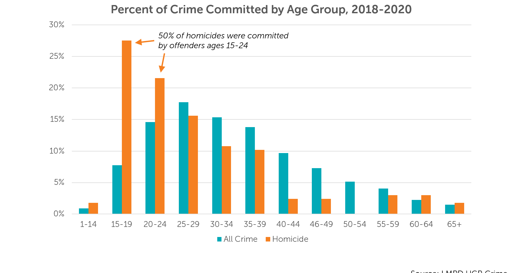
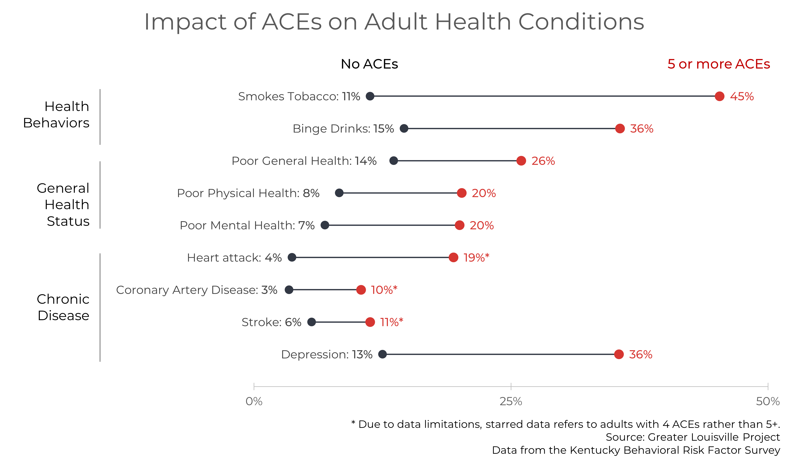
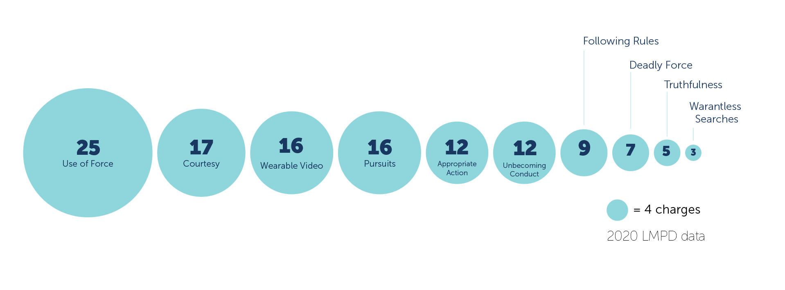
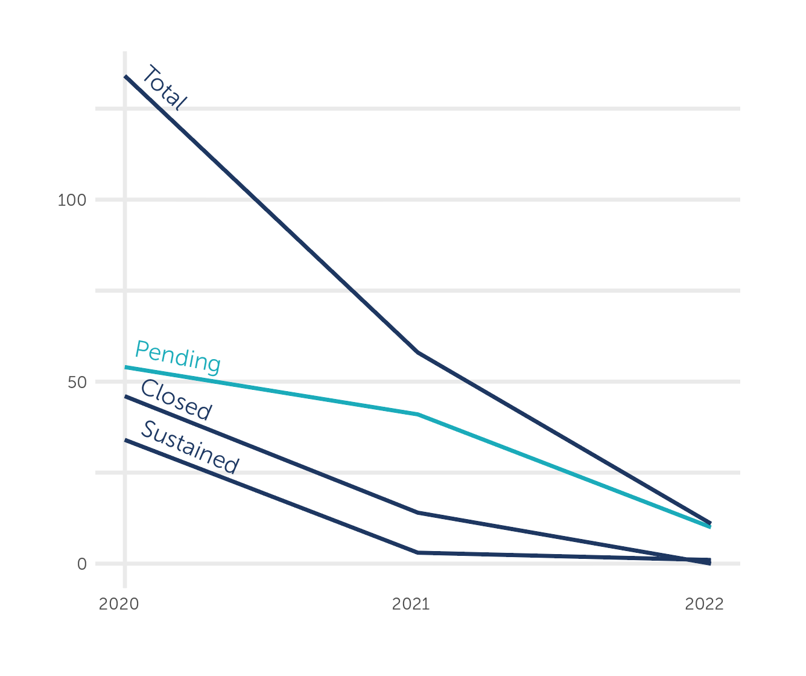

```{r setup, message=FALSE, warning=FALSE}
library(glptools)
library(glpdata)
library(gt)
glp_load_packages(graphs = T)
showtext_auto()
font_add("Museo Sans", "MuseoSans_300.otf")
font_add("Museo Sans 300 Italic", "MuseoSans_300_Italic.otf")
knitr::opts_chunk$set(echo = TRUE, warning = FALSE, message = FALSE, 
                      dev.args=list(bg="transparent"), fig.width=15, fig.height=12)
```

# Introduction

Lopa, here are some various chunks of introductory content! I didn't write it in one go so it more of an anthology of sentences than an introduction.

---

Over the past years, Louisville residents have continuously ranked public safety as the most pressing challenge facing the city, while the data shows that we are moving backwards. In the past few years, Louisville has seen the killings of Breonna Taylor and David McAtee; a surge in shootings and homicides; and a lack of investment substantial enough to bring about a safer city.

Residents and city leaders disagree on which levers to pull in order to correct these problems. Should we invest more in policing? In diversion programs? In our youth? In a broader social safety net? In our communities and the conditions in which we all live?

This report is not designed to settle those debates. Our goals are to provide an honest accounting of violence in our city and to lay out the investments we are making to reduce it. The numbers in this report will not decide which of those investments are effective and dignified. The question of which investments are truly effective is larger than what the Greater Louisville Project can measure. Our goal is not to decide answers, but to support informed conversations for Louisville to make that decision for itself.

According to Path Forward For Louisville, "How we do policing, locally and nationally, must change. Improving police culture and behavior requires changes to the policies, practices, and budgets that govern them." 

All of us want to see a safer city, though opinions diverge on how we can get there. In a Courier Journal survey conducted in December 2021, residents were split as to whether more policing is the answer:

> 47% of all residents polled said they supported cutting police funding to increase social service spending; 46% said they opposed it; 7% said they were undecided.

And residents are also split on whether they trust the police at all.

> Residents in Louisville were split on whether local police "use force only when necessary," with 44% saying they agreed, while 43% said they didn't.  

In a survey conducted in October 2020, 70% of residents responded that they did not trust the LMPD. At the same time, 75% of LMPD personnel indicated they would leave the Department if they could.

Much of the information we have is incomplete, out-of-date, hard-to-find, or missing. For the numbers we obtain through surveys, it is always worth asking who was included in the survey, and more importantly, whose opinion is not reflected. Much of the numbers we have on our youth tell us how they are doing on tests, but we don't have the same insight into their mental health or their engagement with mentors and youth programming.


Through the American Rescue Plan, Louisville will allocate \$67 toward public safety initiatives, 

https://www.courier-journal.com/story/news/local/2021/12/01/poll-where-louisville-stands-defund-police-breonna-taylor/8733007002/
PFA survey results

* Public safety as top issue on public's mind
* Importance of creating a safe community for people and in particular for youth
* Difficult to find information, and missing data


## What is public safety?

* Cities United definition
* Louisville ARP definition
* OSHN defnition

## Protective factors and risk factors

* Discussion of risk factors and protective factors

https://www.samhsa.gov/sites/default/files/20190718-samhsa-risk-protective-factors.pdf


# Violence in Louisville

* The state of things! Before we dig into the information, we want to lead with where we hgave come as a city.

```{r}
clean_wonder <- function(df, method = "sum"){
  
  #new names for variables
  names_recode <- c(
    `County Code`                  = "FIPS",
    `Residence County Code`        = "FIPS",
    `Year Code`                    = "year",
    `Month Code`                   = "month",
    `Single-Year Ages Code`        = "age",
    `Five-Year Age Groups Code`    = "age_5_codes",
    `Ten-Year Age Groups Code`     = "age_10_codes",
    Deaths                         = "deaths",
    Population                     = "population",
    `Birth Weight 12 Code`         = "weight",
    Births                         = "births",
    Race                           = "race",
    `Bridged Race`                 = "race",
    `Mother's Bridged Race`        = "race",
    Gender                         = "sex",
    `Age Adjusted Rate`            = "rate",
    `UCD - ICD-10 113 Cause List`  = "cod",
    `Multiple Cause of death Code` = "cod")


  #list of variables to keep (same as above list)
  keep_names <- c("FIPS", "year", "month", "age", "age_5_codes", "age_10_codes",
                  "deaths", "population", "weight", "births",
                  "race", "sex", "rate", "cod")

  #list of variables to change to numeric
  numeric_names <- c("year", "month", "age", "deaths", "population",
                     "weight", "births", "rate")

  df <- df %>%
    plyr::rename(
      replace = names_recode,
      warn_missing = FALSE)

  if("age_10_codes" %in% names(df)){
    age_10_df <- data.frame(
      age_10_codes = c("1", "1-4", "5-14", "15-24", "25-34", "35-44",
                       "45-54", "55-64", "65-74", "75-84", "85+", "NS"),
      age_10 = c(0:10, NA))

    df %<>%
      left_join(age_10_df, by = "age_10_codes") %>%
      select(-age_10_codes)
  }
  
  if("month" %in% names(df)){
    df %<>%
      mutate(month = str_sub(month, 6, 7))
  }

  #filter rows containing totals (which do not contain specific years)
  df <- df %>%
    filter_at(df %cols_in% c("FIPS", "year", "age", "age_5", "age_10", "race", "sex"), 
              all_vars(!is.na(.)))

  #convert variables to numeric and subset data frame to variables of interest
  df <- df %>%
    mutate_at(df %cols_in% numeric_names, as.numeric) %>%
    select_at(df %cols_in% keep_names)

  if("race" %in% names(df)){
    df %<>%
      mutate(
        race = replace(race, race == "Black or African American", "black"),
        race = replace(race, race == "White", "white"))
  }
  if("sex" %in% names(df)){
    df %<>% mutate(sex = str_to_lower(sex))
  }
  
  df %<>%
    pivot_longer(
      df %cols_in% c("births", "deaths", "rate", "population"),
      names_to = "var_type",
      values_to = df %cols_in% c("births", "deaths", "rate")) %>%
    mutate(var_type = case_when(
      var_type %in% c("births", "deaths") ~ "estimate",
      var_type %in% c("rate") ~ "rate",
      var_type %in% c("population") ~ "population"))

  if ("race" %not_in% names(df)) df$race <- "total"
  if ("sex" %not_in% names(df)) df$sex <- "total"

  df %<>% organize()

  df

}

```

```{r}
deaths_total_99 <- wonder_time("intermediate_data/wonder/demographic_files/deaths_gender_total_99")
deaths_white_99 <- wonder_time("intermediate_data/wonder/demographic_files/deaths_gender_white_99")
deaths_black_99 <- wonder_time("intermediate_data/wonder/demographic_files/deaths_gender_black_99")
deaths_hispanic_99 <- wonder_time("intermediate_data/wonder/demographic_files/deaths_gender_hispanic_99")

deaths_total_99 %<>% 
  clean_wonder()

deaths_white_99 %<>% 
  clean_wonder() %>%
  mutate(race = "white")

deaths_black_99 %<>% 
  clean_wonder() %>%
  mutate(race = "black")

deaths_hispanic_99 %<>% 
  clean_wonder() %>%
  mutate(race = "hispanic")

deaths_total_18 <- wonder_time("intermediate_data/wonder/demographic_files/deaths_gender_total_18")
deaths_blackwhite_18 <- wonder_time("intermediate_data/wonder/demographic_files/deaths_gender_blackwhite_18")
deaths_hispanic_18 <- wonder_time("intermediate_data/wonder/demographic_files/deaths_gender_hispanic_18")

deaths_total_18 %<>% 
  clean_wonder() %>%
  mutate(race = "total") %>%
  filter(year == 2021)

deaths_blackwhite_18 %<>% 
  rename(Race = `Single Race 6`) %>%
  clean_wonder() %>%
  filter(year == 2021)

deaths_hispanic_18 %<>% 
  clean_wonder() %>%
  mutate(race = "hispanic") %>%
  filter(year == 2021)

mortality_age <- bind_rows(deaths_total_99, deaths_white_99) %>%
  bind_rows(deaths_black_99) %>%
  bind_rows(deaths_hispanic_99) %>% 
  bind_rows(deaths_total_18) %>%
  bind_rows(deaths_blackwhite_18) %>%
  bind_rows(deaths_hispanic_18)

mortality_age %<>%
  filter(year >= 2000) %>%
  mutate(cod = case_when(
    cod == "#Assault (homicide) (*U01-*U02,X85-Y09,Y87.1)" ~ "homicide",
    cod == "Assault (homicide) by discharge of firearms (*U01.4,X93-X95)" ~ "homicide_gun",
    cod == "Assault (homicide) by other and unspecified means and their sequelae (*U01.0-*U01.3,*U01.5-*U01.9,*U02,X85-X92,X96-Y09,Y87.1)" ~ "homicide_other",
    cod == "#Intentional self-harm (suicide) (*U03,X60-X84,Y87.0)" ~ "suicide",
    cod == "Intentional self-harm (suicide) by discharge of firearms (X72-X74)" ~ "suicide_gun",
    cod == "Intentional self-harm (suicide) by other and unspecified means and their sequelae (*U03,X60-X71,X75-X84,Y87.0)" ~ "suicide_other"))
  
mortality_age %<>%
  pivot_wider(names_from = "cod", values_from = "deaths")

mortality_age %<>%
  mutate(
    suicide_gun = if_else(is.na(suicide_gun), suicide - suicide_other, suicide_gun),
    suicide_other = if_else(is.na(suicide_other), suicide - suicide_gun, suicide_other),
    homicide_gun = if_else(is.na(homicide_gun), homicide - homicide_other, homicide_gun),
    homicide_other = if_else(is.na(homicide_other), homicide - homicide_gun, homicide_other))

mortality_age_totals <- mortality_age %>%
  filter(FIPS == "total") %>%
  rename(
    suicide_total = suicide,
    suicide_gun_total = suicide_gun,
    suicide_other_total = suicide_other,
    homicide_total = homicide,
    homicide_gun_total = homicide_gun,
    homicide_other_total = homicide_other) %>%
  select(-FIPS)

mortality_age %<>%
  left_join(mortality_age_totals, by = c("year", "sex", "race", "var_type", "age_5_codes"))

mortality_age %<>%
  transmute(
    FIPS, year, sex, race, var_type, 
    age_5 = age_5_codes,
    homicide = homicide - homicide_total,
    homicide_gun = homicide_gun - homicide_gun_total,
    homicide_other = homicide_other - homicide_other_total,
    suicide = suicide - suicide_total,
    suicide_gun = suicide_gun - suicide_gun_total,
    suicide_other = suicide_other - suicide_other_total)

mortality_age_population <- mortality_age %>%
  filter(var_type == "population") %>%
  select(-var_type) %>%
  select(FIPS, year, sex, race, age_5, population = homicide)

mortality_age_estimates <- mortality_age %>%
  filter(var_type == "estimate") %>%
  select(-var_type) 
  
mortality_age <- left_join(mortality_age_estimates, mortality_age_population, by = c("FIPS", "year", "sex", "race", "age_5"))

rm(mortality_age_totals, 
   deaths_total_99, deaths_white_99, deaths_black_99, deaths_hispanic_99,
   deaths_total_18, deaths_blackwhite_18, deaths_hispanic_18,
   mortality_age_population, mortality_age_estimates)

```

```{r}
# Totals
cancer_18                  <- read_tsv("intermediate_data/wonder/totals/cancer.txt")

# Suicide
cancer_suicide_18          <- read_tsv("intermediate_data/wonder/totals/cancer_suicide.txt")
cancer_suicide_gun_18      <- read_tsv("intermediate_data/wonder/totals/cancer_suicide_gun.txt")
cancer_suicide_other_18   <- read_tsv("intermediate_data/wonder/totals/cancer_suicide_other.txt")

# Homicide
cancer_homicide_18          <- read_tsv("intermediate_data/wonder/totals/cancer_homicide.txt")
cancer_homicide_gun_18      <- read_tsv("intermediate_data/wonder/totals/cancer_homicide_gun.txt")
cancer_homicide_other_18   <- read_tsv("intermediate_data/wonder/totals/cancer_homicide_other.txt")

# Totals
cancer_99                  <- read_tsv("intermediate_data/wonder/totals/cancer_99.txt")

# Suicide
cancer_suicide_99          <- read_tsv("intermediate_data/wonder/totals/cancer_suicide_99.txt")
cancer_suicide_gun_99      <- read_tsv("intermediate_data/wonder/totals/cancer_suicide_gun_99.txt")
cancer_suicide_other_99   <- read_tsv("intermediate_data/wonder/totals/cancer_suicide_other_99.txt")

# Homicide
cancer_homicide_99          <- read_tsv("intermediate_data/wonder/totals/cancer_homicide_99.txt")
cancer_homicide_gun_99      <- read_tsv("intermediate_data/wonder/totals/cancer_homicide_gun_99.txt")
cancer_homicide_other_99   <- read_tsv("intermediate_data/wonder/totals/cancer_homicide_other_99.txt")

# Clean suicide data
cancer_99 %<>% clean_wonder %>% filter(year >= 2000)
cancer_18 %<>% clean_wonder %>% filter(year >= 2021)

cancer <- bind_rows(cancer_99, cancer_18) %>%
  rename(cancer = deaths)

cancer_suicide_99 %<>% clean_wonder %>% filter(year >= 2000)
cancer_suicide_18 %<>% clean_wonder %>% filter(year >= 2021)
  
cancer_suicide  <- bind_rows(cancer_suicide_99, cancer_suicide_18) %>%
  rename(cancer_suicide = deaths)

cancer_suicide_gun_99 %<>% clean_wonder %>% filter(year >= 2000)
cancer_suicide_gun_18 %<>% clean_wonder %>% filter(year >= 2021)

cancer_suicide_gun <- bind_rows(cancer_suicide_gun_99, cancer_suicide_gun_18) %>%
  rename(cancer_suicide_gun = deaths)

cancer_suicide_other_99 %<>% clean_wonder %>% filter(year >= 2000)
cancer_suicide_other_18 %<>% clean_wonder %>% filter(year >= 2021)

cancer_suicide_other <- bind_rows(cancer_suicide_other_99, cancer_suicide_other_18) %>%
  rename(cancer_suicide_other = deaths)

# Clean homicide data
cancer_homicide_99 %<>% clean_wonder %>% filter(year >= 2000)
cancer_homicide_18 %<>% clean_wonder %>% filter(year >= 2021)
  
cancer_homicide  <- bind_rows(cancer_homicide_99, cancer_homicide_18) %>%
  rename(cancer_homicide = deaths)

cancer_homicide_gun_99 %<>% clean_wonder %>% filter(year >= 2000)
cancer_homicide_gun_18 %<>% clean_wonder %>% filter(year >= 2021)

cancer_homicide_gun <- bind_rows(cancer_homicide_gun_99, cancer_homicide_gun_18) %>%
  rename(cancer_homicide_gun = deaths)

cancer_homicide_other_99 %<>% clean_wonder %>% filter(year >= 2000)
cancer_homicide_other_18 %<>% clean_wonder %>% filter(year >= 2021)

cancer_homicide_other <- bind_rows(cancer_homicide_other_99, cancer_homicide_other_18) %>%
  rename(cancer_homicide_other = deaths)

# Combine clean dataframes
mortality_totals <- 
  bind_df(cancer, 
          cancer_suicide, cancer_suicide_gun, cancer_suicide_other,
          cancer_homicide, cancer_homicide_gun, cancer_homicide_other)

mortality_totals_population <- mortality_totals %>%
  filter(var_type == "population") %>%
  transmute(FIPS, year, sex, race,
            population = cancer)

mortality_totals_estimate <- mortality_totals %>%
  filter(var_type == "estimate") %>%
  transmute(
    FIPS, year, sex, race, 
    suicide = cancer_suicide - cancer,
    suicide_gun = cancer_suicide_gun - cancer,
    suicide_other = cancer_suicide_other - cancer,
    homicide = cancer_homicide - cancer,
    homicide_gun = cancer_homicide_gun - cancer,
    homicide_other = cancer_homicide_other - cancer)

mortality_totals <- bind_df(mortality_totals_estimate, mortality_totals_population)

mortality_totals %<>%
  mutate(age_5 = "total")

rm(cancer, 
   cancer_homicide_99, cancer_homicide_gun_99, cancer_homicide_other_99, 
   cancer_suicide_99, cancer_suicide_gun_99, cancer_suicide_other_99,
   cancer_homicide_18, cancer_homicide_gun_18, cancer_homicide_other_18, 
   cancer_suicide_18, cancer_suicide_gun_18, cancer_suicide_other_18,
   cancer_homicide, cancer_homicide_gun, cancer_homicide_other, 
   cancer_suicide, cancer_suicide_gun, cancer_suicide_other,
   mortality_totals_estimate, mortality_totals_population)

```

```{r}
mortality <- bind_rows(mortality_totals, mortality_age)

mortality_collapsed <- mortality %>% 
  group_by(FIPS, year, race, age_5) %>%
  summarize(across(suicide:population, sum), .groups = "drop") %>%
  mutate(sex = "total")

mortality %<>%
  bind_rows(mortality_collapsed) %>%
  select(FIPS, year, sex, race, age_5, 
         homicide, homicide_gun, homicide_other, 
         suicide, suicide_gun, suicide_other, 
         population) %>%
  filter(FIPS != "total")

# Fix St. Louis
mortality %<>%
  mutate(FIPS = replace(FIPS, FIPS %in% c("29189", "29510"), "MERGED")) %>%
  group_by(FIPS, year, sex, race, age_5) %>%
  summarize(across(homicide:population, sum), .groups = "drop")

mortality %<>% 
  group_by(year, sex, race, age_5) %>%
  mutate(adj = population[FIPS == "21111"] / population) %>%
  ungroup() %>%
  filter(age_5 %not_in% c("1", "1-4", "5-9", "10-14", "70-74", "75-79", "80-84", "85-89", "90-94", "95-99", "100+", "NS"))


mortality_wide <- mortality %>%
  mutate(across(homicide:suicide_other, ~ . * adj)) %>%
  select(-adj, -population) %>%
  pivot_longer(homicide:suicide_other, names_to = "cod") %>%
  pivot_wider(names_from = "age_5", values_from = "value")


rm(mortality_totals, mortality_age)
```

```{r overdose}
# All deaths
all                  <- read_tsv("intermediate_data/wonder/overdose_totals/all_18.txt")

# drug vs nondrug
drug                  <- read_tsv("intermediate_data/wonder/overdose_totals/drug_18.txt")

# Except
except_unintentional <- read_tsv("intermediate_data/wonder/overdose_totals/except_unintentional_18.txt")
except_suicide <- read_tsv("intermediate_data/wonder/overdose_totals/except_suicide_18.txt")
except_homicide <- read_tsv("intermediate_data/wonder/overdose_totals/except_homicide_18.txt")
except_undetermined <- read_tsv("intermediate_data/wonder/overdose_totals/except_undetermined_18.txt")
except_other <- read_tsv("intermediate_data/wonder/overdose_totals/except_other_18.txt")


all %<>% 
  clean_wonder() %>%
  rename(all = deaths)

drug %<>% 
  clean_wonder() %>%
  rename(drug = deaths)

except_unintentional %<>% 
  clean_wonder() %>%
  rename(unintentional = deaths)

except_suicide %<>% 
  clean_wonder() %>%
  rename(suicide = deaths)

except_homicide %<>% 
  clean_wonder() %>%
  rename(homicide = deaths)

except_undetermined %<>% 
  clean_wonder() %>%
  rename(undetermined = deaths)

except_other %<>% 
  clean_wonder() %>%
  rename(other = deaths)


overdose <- bind_df(all, drug, except_unintentional, except_suicide, except_homicide, except_undetermined, except_other)

overdose_estimate <- overdose %>%
  filter(var_type == "estimate") %>%
  transmute(
    FIPS, year, sex, race,
    unintentional = all - unintentional,
    suicide = all - suicide,
    homicide = all - homicide,
    undetermined = all - undetermined,
    other = all - other,
    overdoses = unintentional + suicide + homicide + undetermined + other)

overdose_population <- overdose %>%
  filter(var_type == "population") %>%
  select(
    FIPS, year, sex, race, population = all)
  
overdose <- overdose_estimate %>%
  left_join(overdose_population, by = c("FIPS", "year", "sex", "race"))

overdose_totals <- overdose %>%
  group_by(FIPS, year, race) %>%
  summarize(across(unintentional:population, sum), .groups = "drop") %>%
  mutate(sex = "total")

overdose %<>%
  bind_rows(overdose_totals)

overdose %<>% 
  group_by(year, sex, race) %>%
  mutate(adj = population[FIPS == "21111"] / population) %>%
  ungroup()

```


## Shootings

* Number of shootingd has increased, we think?

### Trends

Here, we will include data from LMPD crime reports.

### Age of offenders / victims

Here, we will link the shooting data to age of perpetrators and victims to discuss impact on youth



### Demographics

I think we can get gender and race to discusss dirproportionate impacts of shootings. I'm not 100% sure, though. I know we can get this data for deaths in the following sections, though.

## Homicide

### Overall {.tabset}

#### Ranking

Louisville ranks around the middle of its peers.

```{r}
this_title <- "Homicide"
this_subtitle = "Adjusted for population"
this_caption <- "\n\nData from CDC Wonder, 2022"
this_caption_trend_graphs <- "\n\nData from CDC Wonder, 2022"

temp <- mortality %>%
  filter(age_5 == "total") %>%
  mutate(homicide = homicide * adj)

ranking(
  temp,
  homicide,
  year = 2021,
  plot_title = "Homicide, 2021",
  caption_text = this_caption,
  subtitle_text = this_subtitle,
  y_title = "Deaths",
  label_function = comma_format(accuracy = 1),
  ranking_colors = FALSE,
  order = "ascending")
```

#### Trend

Louisville's homicide rate in 2021 was the highest in history that we have seen as a city.

```{r}
trend(
  filter(temp, year < 2022),
  homicide,
  plot_title = this_title,
  caption_text = this_caption,
  label_function = comma_format(accuracy = 1),
  y_title = "Deaths")
```

#### by Age

(I don't expect to include this data, so haven't tried to shape up how it's visualized.)

This graph shows the number of homicides by age group in Louisville for 2021 compared to other cities. Louisville is the blue bar, the peer mean is the black dot, and the 25th and 75th percentiles are the whiskers coming off the dot.

```{r}
temp <- mortality %>% 
  pull_peers(add_info = T)

graph_df <- temp %>%
  filter(city == "Louisville", 
         sex == "total",
         race == "total",
         age_5 != "total") %>%
  select(year, age_5, lou = homicide)

temp %<>%
  filter(city != "Louisville", 
         current == 1,
         sex == "total",
         race == "total",
         age_5 != "total") %>%
  group_by(year, age_5) %>%
  summarise(q1 = quantile(homicide, prob = 0.25, na.rm = TRUE),
            mean = mean(homicide, na.rm = TRUE),
            q3 = quantile(homicide, prob = 0.75, na.rm = TRUE),
            .groups = "drop")
  
graph_df %<>%
  left_join(temp, by = c("year", "age_5")) %>%
  filter(year == 2021)

ggplot(graph_df) +
  geom_bar(aes(x = age_5, y = lou), fill = "#00A9B7", stat = "identity") +
  geom_errorbar(aes(x = age_5, ymin = q1, ymax = q3), width = 0.4, size = 1.3, color = "grey50") +
  geom_point(aes(x = age_5, y = mean), size = 6) +
  theme_bw(
    base_size = 11,
    base_family = "Museo Sans")

  

```


### Youth homicide {.tabset}

#### Ranking

```{r}
this_title <- "Youth Homicide"
this_subtitle = "Ages 15-24; adjusted for population"

temp <- mortality %>%
  filter(age_5 %in% c("15-19", "20-24")) %>%
  group_by(FIPS, year, sex, race) %>%
  summarize(homicide = sum(homicide * adj), 
            .groups = "drop") 

ranking(
  temp,
  homicide,
  year = 2021,
  plot_title = "Youth Homicide, 2021",
  caption_text = this_caption,
  subtitle_text = this_subtitle,
  y_title = "Deaths",
  label_function = comma_format(accuracy = 1),
  ranking_colors = FALSE,
  order = "ascending")


```

#### Trend

```{r}
trend(
  filter(mortality_wide, year < 2022, cod == "homicide"),
  `15-19`:`20-24`,
  cat = c("15-19" = "15-19", "20-24" = "20-24"),
  plot_title = this_title,
  subtitle_text = this_subtitle,
  caption_text = this_caption_trend_graphs,
  label_function = comma_format(accuracy = 1),
  pctiles = F,
  y_title = "Deaths")

```

#### Increase

```{r}
temp %>% 
  group_by(FIPS) %>% 
  filter(sex == "total", race == "total") %>%
  mutate(results = homicide[year == 2021] - homicide[year == 2000]) %>%
  ungroup() %>%
ranking(
  results,
  plot_title = "Change in Youth Gun Homicide Victims,  2000 to 2021",
  subtitle_text = this_subtitle,
  caption_text = this_caption,
  y_title = "Change in Deaths",
  label_function = comma_format(accuracy = 1),
  order = "ascending")
```

#### by Race

```{r}
trend(
  temp,
  homicide,
  cat = "race",
  plot_title = this_title,
  subtitle_text = this_subtitle,
  caption_text = this_caption_trend_graphs,
  label_function = comma_format(accuracy = 1),
  pctiles = F,
  y_title = "Deaths")
```


#### by Gender

```{r}
trend(
  temp,
  homicide,
  cat = "sex",
  plot_title = this_title,
  subtitle_text = this_subtitle,
  caption_text = this_caption_trend_graphs,
  label_function = comma_format(accuracy = 1),
  pctiles = F,
  y_title = "Deaths")
```

## Suicide

### Overall {.tabset}

#### Ranking

Louisville ranks around the middle of its peers.

```{r}
this_title <- "Suicide"
this_subtitle = "Adjusted for population"
this_caption <- "\n\nData from CDC Wonder, 2022"
this_caption_trend_graphs <- "\n\nData from CDC Wonder, 2022"

temp <- mortality %>%
  filter(age_5 == "total") %>%
  mutate(suicide = suicide * adj)

ranking(
  temp,
  suicide,
  year = 2021,
  plot_title = "Suicide, 2021",
  caption_text = this_caption,
  subtitle_text = this_subtitle,
  y_title = "Deaths",
  label_function = comma_format(accuracy = 1),
  ranking_colors = FALSE,
  order = "ascending")
```

#### Trend

Louisville's homicide rate in 2021 was the highest in history that we have seen as a city.

```{r}
trend(
  filter(temp, year < 2022),
  suicide,
  plot_title = this_title,
  caption_text = this_caption,
  label_function = comma_format(accuracy = 1),
  y_title = "Deaths")
```

#### by Age

(I don't expect to include this data, so haven't tried to shape up how it's visualized.)

```{r}
temp <- mortality %>% 
  pull_peers(add_info = T)

graph_df <- temp %>%
  filter(city == "Louisville", 
         sex == "total",
         race == "total",
         age_5 != "total") %>%
  select(year, age_5, lou = suicide)

temp %<>%
  filter(city != "Louisville", 
         current == 1,
         sex == "total",
         race == "total",
         age_5 != "total") %>%
  group_by(year, age_5) %>%
  summarise(q1 = quantile(suicide, prob = 0.25, na.rm = TRUE),
            mean = mean(suicide, na.rm = TRUE),
            q3 = quantile(suicide, prob = 0.75, na.rm = TRUE),
            .groups = "drop")
  
graph_df %<>%
  left_join(temp, by = c("year", "age_5")) %>%
  filter(year == 2021)

ggplot(graph_df) +
  geom_bar(aes(x = age_5, y = lou), fill = "#00A9B7", stat = "identity") +
  geom_errorbar(aes(x = age_5, ymin = q1, ymax = q3), width = 0.4, size = 1.3, color = "grey50") +
  geom_point(aes(x = age_5, y = mean), size = 6) +
  theme_bw(
    base_size = 11,
    base_family = "Museo Sans")

  

```

### Youth suicide {.tabset}

This doesn't include poeple younger than 15.

#### Ranking

```{r}
this_title <- "Youth Suicide"
this_subtitle = "Ages 15-24; adjusted for population"

temp <- mortality %>%
  filter(age_5 %in% c("15-19", "20-24")) %>%
  group_by(FIPS, year, sex, race) %>%
  summarize(suicide = sum(suicide * adj), 
            .groups = "drop") 

ranking(
  temp,
  suicide,
  year = 2021,
  plot_title = "Youth Suicide, 2021",
  caption_text = this_caption,
  subtitle_text = this_subtitle,
  y_title = "Deaths",
  label_function = comma_format(accuracy = 1),
  ranking_colors = FALSE,
  order = "ascending")


```

#### Trend

```{r}
trend(
  filter(mortality_wide, year < 2022, cod == "suicide"),
  `15-19`:`20-24`,
  cat = c("15-19" = "15-19", "20-24" = "20-24"),
  plot_title = this_title,
  subtitle_text = this_subtitle,
  caption_text = this_caption_trend_graphs,
  label_function = comma_format(accuracy = 1),
  pctiles = F,
  y_title = "Deaths")

```

#### by Race

```{r}
trend(
  temp,
  suicide,
  cat = "race",
  plot_title = this_title,
  subtitle_text = this_subtitle,
  caption_text = this_caption_trend_graphs,
  label_function = comma_format(accuracy = 1),
  pctiles = F,
  y_title = "Deaths")
```


#### by Gender

```{r}
trend(
  temp,
  suicide,
  cat = "sex",
  plot_title = this_title,
  subtitle_text = this_subtitle,
  caption_text = this_caption_trend_graphs,
  label_function = comma_format(accuracy = 1),
  pctiles = F,
  y_title = "Deaths")
```

## Overdoses

### Overall

#### Ranking

Louisville ranks around the middle of its peers.

```{r}
this_title <- "Overdoses"
this_subtitle = "Adjusted for population"
this_caption <- "\n\nData from CDC Wonder, 2022"
this_caption_trend_graphs <- "\n\nData from CDC Wonder, 2022"

temp <- overdose %>%
  mutate(overdoses = overdoses * adj)

ranking(
  temp,
  overdoses,
  year = 2021,
  plot_title = "Overdoses, 2021",
  caption_text = this_caption,
  subtitle_text = this_subtitle,
  y_title = "Deaths",
  label_function = comma_format(accuracy = 1),
  ranking_colors = FALSE,
  order = "ascending")
```

#### Trend

Louisville's homicide rate in 2021 was the highest in history that we have seen as a city.

```{r}
trend(
  filter(temp, year < 2022),
  overdoses,
  plot_title = this_title,
  caption_text = this_caption,
  label_function = comma_format(accuracy = 1),
  y_title = "Deaths")
```

### Youth

# Policing

Many communities have relied on police officers as somewhat of a catch-all response to all kinds of crises. However, some say that many of these crises do not merit a police response; instead, they would be better solved by mental health experts and other providers of social services. 

Communities big and small — Phoenix, Portland, Tucson and Wichita, to name a few — have experimented in recent years with so-called alternative responder models in which police officers are not the default first response to a crisis. 

## Clearance Rates

```{r, eval=FALSE}

setwd("..")

folders <- list.files("NIBRS", include.dirs = TRUE)


agencies <- data.frame()
incidents <- data.frame()
offenses <- data.frame()
arrestees <- data.frame()
clearances <- data.frame()

for (i in 1:length(folders)) {
  
  f <- folders[i]
  
  this_agency    <- read_csv("NIBRS/" %p% f %p% "/agencies.csv")
  this_incident  <- read_csv("NIBRS/" %p% f %p% "/NIBRS_incident.csv", col_types = "nnnnldlnndclln")
  this_offense   <- read_csv("NIBRS/" %p% f %p% "/NIBRS_OFFENSE.csv")
  this_arrestee  <- read_csv("NIBRS/" %p% f %p% "/NIBRS_ARRESTEE.csv", col_types = "nnnndnccnncnncclcc")
  this_clearance <- read_csv("NIBRS/" %p% f %p% "/NIBRS_CLEARED_EXCEPT.csv", col_types = "nccc")
  
  agencies   <- bind_rows(agencies, this_agency)
  incidents  <- bind_rows(incidents, this_incident)
  offenses   <- bind_rows(offenses, this_offense)
  arrestees  <- bind_rows(arrestees, this_arrestee)
  clearances <- bind_rows(clearances, this_clearance)
  
}
```


```{r, eval=FALSE}
FIPS_join <- FIPS_info %>%
  mutate(county = str_to_upper(county))

FIPS_join$county[FIPS_join$county == "ST. LOUIS"] <- "ST LOUIS"

agencies %<>%
  transmute(
    agency_id,
    agency_name = str_to_title(ncic_agency_name),
    county = county_name,
    state_abbr = state_postal_abbr,
    population) %>%
  separate(county, ", ", into = c("county1", "county2", "county3", "county4")) %>%
  pivot_longer(county1:county4, names_to = "county_col", values_to = "county") %>%
  filter(!is.na(county)) %>%
  select(-county_col) %>%
  left_join(FIPS_join, by = c("county", "state_abbr")) %>%
  filter(!is.na(FIPS))

peer_agencies <- agencies %>%
  select(agency_id, FIPS)

peer_incidents <- incidents %>%
  left_join(peer_agencies, by = "agency_id") %>%
  filter(!is.na(FIPS))

peer_offenses <- offenses %>%
  filter(offense_code %in% c("09A", "09B", "09C"))

peer_homicides <- peer_

table(peer_incidents$FIPS)
incident_simple


```

~[](images/homicide-clearance.png)

## Louisville's Recent History of Alternative Responder Models
Over the last decade, Louisville has experimented with a few of these *alternative responder* models, aiming to reroute crisis calls from the police to mental health experts, social service providers and other experts who might be able to respond more appropriately. 

All of these pilot programs enjoyed some success but **none are around to today** largely because of a lack of funding. 


*Note: This historical account is adapted from the Louisville Metro Alternative Responder Model Research and Planning Final Report from the Commonwealth Institute of Kentucky (September 2021)*

> Outcomes:

* Nurse Triage Program: The program was largely successful, and it expanded from one nurse to two. However, the program ran out of grant funding. 
* Domestic Violence Victim Advocates: The victim advocates involved in the program reported that the program had positive effects on those experiencing trauma but also noted that the need in the community exceeded the capacity of their small team.
* Law Enforcement Assisted Diversion: The program served fewer people than expected over its relatively short lifespan. Other challenges included staff turnover in partner agencies and limited buy-in from partner agencies.
* The Living Room: The program was largely successful in that it provided wide access to behavioral health services while avoiding jail time, court fees, inpatient stays and housing and employment disruptions. It also resulted in cost savings to the Metro Government. However, budget cuts ultimately shuttered the program.

## Existing LMPD Mental Health Initiatives

The Crisis Intervention Team (CIT) model is a popular training program that teaches officers how to interact with and respond to those experiencing mental health crises. 

LMPD officers receive 40 hours of CIT training, and there are CIT-trained individuals available on every shift in every police division. However, according to researchers at the University of Louisville's Commonwealth Institute of Kentucky, "LMPD does not routinely evaluate its CIT program and impact, outcomes, and efficiency."

In addition to the 40 hours of CIT training for some current LMPD officers, LMPD recruits going through the police academy complete 38.5 hours of CIT training. 

Apart from CIT training, in February 2021, LMPD created its Mobile Response Unit with two homelessness officers. The unit has performed wellness checks and partnered with various community organizations to document homelessness and provide various resources. 

## LMPD's Investment in Social Services

The total number of LMPD officers has risen and fallen over the last 15 years. It hit its peak in fiscal year 2018, at 1,027 officers. As of fiscal year 2020, there are now 956 officers. 

Meanwhile, for most of the last 15 years, LMPD has employed one or even no employees focused on social services, according to a GLP analysis of Louisville Metro Government documents. GLP included the positions of victim advocate, social service program coordinator and similar iterations of these positions in its analysis. 

In the most recent fiscal year in which data is available (2020), LMPD employed four individuals with a focus on providing social services to the community. 

```{r total officers, warning=FALSE, message=FALSE}

officer_data <- read.csv('intermediate_data/lmpd_victim_advocates.csv')

library(ggplot2)

total_officers <- ggplot(officer_data, aes(x=fiscal_year, y=police_officer)) +
  geom_line() + 
  theme_minimal()

total_social_services <- ggplot(officer_data, aes(x=fiscal_year, y=social_services)) +
  geom_line() + 
  theme_minimal()
```


## Mental Health Calls to LMPD that Could be Deflected

In 2021, LMPD responded to 192,445 calls. Of those calls, 7,996 calls were mental health related (about 4%). An analysis by researchers at the Commonwealth Institute of Kentucky found that trained professionals other than police officers could have responded to 5,661 of those 7,996 mental health calls (71%). This is known as deflection.

Communities across the country have called for more police deflection, in favor of crisis response by mental health professionals and other social service providers. 

In March, Louisville officially launched a [$5 million pilot program](https://louisvilleky.gov/news/mayor-fischer-announces-official-start-pilot-project-deflect-some-911-calls-non-police) to deflect some 911 calls to other behavioral health professionals.

> Louisville's new police deflection pilot program 11 trained professionals. Seven of those professionalls will be in the field responding to calls. Two will be answering 911 calls at a hub at MetroSafe, and two are case managers who will provide follow up services after 911 calls.

The pilot program began in LMPD's 4th Division with one shift, 7 days per week. The 4th Division received the most mental health calls in 2021, followed by the 1st Division.

```{r district map, warning=FALSE, message=FALSE}

#install.packages('geojsonio')
library(geojsonio)
library(ggplot2) 
library(broom)

districts <- geojson_read("intermediate_data/Louisville_KY_Metro_Police_Districts.geojson",  what = "sp")

districts_fortified <- tidy(districts)

district_map <- ggplot() +
  geom_polygon(data = districts_fortified, aes(x = long, y = lat, group = group), fill="white", color="black") +
  theme_void() +
  coord_map()
```


# Investing in safety

## City budget analysis


## American Rescue Plan Funding


## Investing in Youth 

### Funding to Youth Programming


### Data on Youth Wellbeing

```{r}

youth_data_sources <- data.frame(
  Topic = 
    c("Mental Health in JCPS",
      "Disconnected Youth",
      "Youth Housing Instability",
      "JCPS Transition to Adult Life",
      "Funding to Youth Programming",
      "Youth Violence"),
  `Data Source` = 
    c("Kentucky Incentives for Prevention Survey",
      "JCPS / Kentucky Department of Education",
      "U.S. Census Bureau",
      "U.S. Census Bureau",
      "IRS Filings from Nonprofits",
      "Centers for Disease Control"),
  `Current Year of Data` = 
    c(2018,
      2019,
      2019,
      2019,
      2020,
      2021),
  `Next Data Release` = c(
    "Unsure",
    "September 2022",
    "December 2022",
    "December 2022",
    "December 2022",
    "March 2022"),
  Explanation = c(
    "The Kentucky Incentives for Prevention Survey is Kentucky’s largest source of data related to youth use of alcohol, tobacco, and other drugs (ATOD), as well as a number of additional factors related to adolescent social and emotional well-being. This survey was last conducted in 2021 following the COVID-19 pandemic; however, participation is voluntary. JCPS declined to conduct the survey in 2021, and as a result, 2018 is the last year for which we have this data.",    "JCPS provides data on students' plans following graduation--entry into the workforce or military, college attendance, etc. While we have 2020 data, it is not comparable to other years due to diruptions from the COVID-19 pandemic. We await the next data release in September 2022.",
    "The U.S. Census Bureau administers an annual household survey (the American Community Survey, or ACS) which provides a variety of data on demographics, housing, and economics. Disruptions due to COVID-19 rendered the 2020 data inaccurate, so we await the 2021 data release coming in December 2022.",
    "The U.S. Census Bureau administers an annual household survey (the American Community Survey, or ACS) which provides a variety of data on demographics, housing, and economics. Disruptions due to COVID-19 rendered the 2020 data inaccurate, so we await the 2021 data release coming in December 2022.",
    "Tax filings for nonprofit organizations are public information, which allows us to understand the landscape of investment in youth programs in Louisville. The IRS has released all on-time filings for tax year 2020, and we will get newwer data on a rolling basis as tax returns for 2021 are submitted and released.",
    "The CDC releases mortality data on a monthly basis. This gives us insight into gun violence and other deaths for youth and young adults in Louisville."))

gt(youth_data_sources) 


```


# Archive

This is content that we are planning to cut!

## Adverse Childhood Experiences



## LMPD

> A Broader Look at Police Spending:

Zooming out briefly, here's a look at the most recent LMPD budget and specifically how much the department spends on its officers and other personnel vs. other expenses, compared to its peers. 

For this analysis, GLP focused on the peer cities of Nashville, Indianapolis and St. Louis. These are all cities in which the combined city and county public safety spending could be determined relatively easily and, therefore, compared with the Louisville metro area.

Louisville and Nashville spend about the same on their police departments. However, Nashville spends more of its budget on its police officers and other personnel (98%) than Louisville (94%). Louisville spends relatively more on its contracts with out other vendors. 

Additionally, even though Louisville and Nashville have lower overall police budgets than Indianapolis and St. Louis, they both set aside a greater chunk of their budget for their officers and other personnel than Indianapolis and St. Louis. 

```{r public safety waffle charts, warning=FALSE, message=FALSE}

library(ggplot2)
library(waffle)

louisville_police_spending <- c(`Personnel ($176.5M)`=176514100, `Contracts ($8.4M)`=8449200, 
             `Supplies ($2.2M)`=2244600, `Equipment and Capital ($878.6K)`=878600, `Utilities ($30.6K)`=30600)
louisville_waffle <- waffle(louisville_police_spending/500000, rows=10, size=0.5, 
       colors=c("#01acbb", "#f48422", "#520b34", "#1b3663", "#45644c"), 
       xlab="1 square == $500K")

nashville_police_spending <- c(`Personnel ($184.3M)`=184308627, `Contracts ($731K)`=731118, 
             `Equipment and Capital ($2.6M)`=2617006, `Utilities ($56.4K)`=56414)
nashville_waffle <- waffle(nashville_police_spending/500000, rows=10, size=0.5, 
       colors=c("#01acbb", "#f48422", "#520b34", "#1b3663"), 
       xlab="1 square == $500K")

st_louis_police_spending <- c(`Personnel ($237.7M)`=237696985, `Contracts ($18M)`=17950338, 
             `Equipment and Capital ($2.8M)`=2765396, `Supplies ($4.6M)`=4623194)
stlouis_waffle <- waffle(st_louis_police_spending/500000, size=0.5,
       colors=c("#01acbb", "#f48422", "#520b34", "#1b3663"), 
       xlab="1 square == $500K")

indianapolis_police_spending <- c(`Personnel ($200M)`=199974660, `Contracts ($20M)`=20013384, 
             `Equipment and Capital ($9.4M)`=9432587, `Supplies ($2M)`=2002650)
indianapolis_waffle <- waffle(indianapolis_police_spending/500000,size=0.5, 
       colors=c("#01acbb", "#f48422", "#520b34", "#1b3663"), 
       xlab="1 square == $500K")

```


LMPD's police budget has continually increased over time — especially recently with tens of millions of dollars flowing in from the American Rescue Plan. 

Police salaries have also increased over time. In December 2021, Metro Council members approved a 9% raise for officers and sergeants for the 2021-22 year and a 6% raise for the following year. 

Currently, LMPD officers make nearly $57,000 after graduating from the police academy. That's \$24,000 above the \$32,705 pre-tax living wage for one adult with no children in Louisville, according to MIT.

A few of Louisville's peer cities pay their officers even more above the area living wage: Cincinnati, Columbus, Indianapolis and Tulsa. 

```{r police officer salaries, warning=FALSE, message=FALSE}

#devtools::install_github("hrbrmstr/ggalt")
library(ggplot2)
library(ggalt)
theme_set(theme_classic())

officer_salaries <- read.csv('intermediate_data/police_officer_salary_peers.csv')
officer_salaries$city <- factor(officer_salaries$city, levels=as.character(officer_salaries$city))  

officer_salaries$city <- factor(officer_salaries$city)

dumbbell <- ggplot(officer_salaries, aes(x=living_wage, xend=after_graduation, y=city, group=city)) + 
        geom_dumbbell(color="#01acbb", 
                      size=1.5, 
                      point.colour.l="#1b3663") + 
        scale_x_continuous() + 
        labs(x=NULL, 
             y=NULL) +
        theme(plot.title = element_text(hjust=0.5, face="bold"),
              panel.grid.minor=element_blank(),
              panel.grid.major.y=element_blank(),
              panel.grid.major.x=element_line(),
              axis.ticks=element_blank(),
              legend.position="top",
              panel.border=element_blank())

```


## LMPD Professional Standards Unit Investigations

Those who advocate for police officers to respond to fewer types of calls in the community sometimes point to police misconduct data. 

Here's a closer look at Professional Standards Unit investigations over the past couple of years. The PSU is responsible for conducting "internal, administrative investigations of departmental members and administering the department’s drug testing program," according to LMPD documents. 

In 2020, the most common allegation or charge against LMPD officers involved use of force, followed by concerns with courtesy and officers' wearable video systems. 



Over the last few years, the number of PSU investigations has declined. 

More than 40% of the investigations launched in 2020 are still pending, even two years later, and more than 70% of the investigations launched in 2021 are still pending. Overall, in any given year, a greater proportion of investigations are closed through various means (i.e. the charges are unfounded, the officer is exonerated, etc.) than sustained. 

Generally, over the past few years, most investigations have resulted in a written reprimand or suspension. Relatively few have resulted in termination or demotion.

```{r PSU outcomes, warning=FALSE, message=FALSE}

library(ggplot2) 

psu_outcomes <- read.csv('intermediate_data/PSU_investigations.csv')

psu_outcomes <- ggplot(psu_outcomes, aes(x=year)) +
  geom_line(aes(y = pending), color = "#01acbb") +
  geom_line(aes(y = sustained), color = "#1b3663") +
  geom_line(aes(y = closed), color = "#1b3663") +
  geom_line(aes(y = total), color = "#1b3663") +
  theme_minimal()

```



