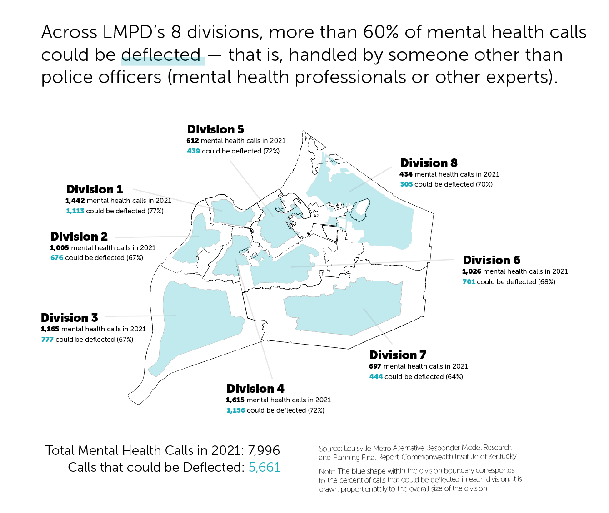

Many communities have relied on police officers as somewhat of a catch-all response to all kinds of crises. However, some say that many of these crises do not merit a police response; instead, they would be better solved by mental health experts and other providers of social services. 

Communities big and small — Phoenix, Portland, Tucson and Wichita, to name a few — have experimented in recent years with so-called alternative responder models in which police officers are not the default first response to a crisis. 

### Louisville's Recent History of Alternative Responder Models
Over the last decade, Louisville has experimented with a few of these *alternative responder* models, aiming to reroute crisis calls from the police to mental health experts, social service providers and other experts who might be able to respond more appropriately. 

All of these pilot programs enjoyed some success but **none are around to today** largely because of a lack of funding. 


*Note: This historical account is adapted from the Louisville Metro Alternative Responder Model Research and Planning Final Report from the Commonwealth Institute of Kentucky (September 2021)*

> Outcomes:

* Nurse Triage Program: The program was largely successful, and it expanded from one nurse to two. However, the program ran out of grant funding. 
* Domestic Violence Victim Advocates: The victim advocates involved in the program reported that the program had positive effects on those experiencing trauma but also noted that the need in the community exceeded the capacity of their small team.
* Law Enforcement Assisted Diversion: The program served fewer people than expected over its relatively short lifespan. Other challenges included staff turnover in partner agencies and limited buy-in from partner agencies.
* The Living Room: The program was largely successful in that it provided wide access to behavioral health services while avoiding jail time, court fees, inpatient stays and housing and employment disruptions. It also resulted in cost savings to the Metro Government. However, budget cuts ultimately shuttered the program.

### Existing LMPD Mental Health Initiatives

The Crisis Intervention Team (CIT) model is a popular training program that teaches officers how to interact with and respond to those experiencing mental health crises. 

LMPD officers receive 40 hours of CIT training, and there are CIT-trained individuals available on every shift in every police division. However, according to researchers at the University of Louisville's Commonwealth Institute of Kentucky, "LMPD does not routinely evaluate its CIT program and impact, outcomes, and efficiency."

In addition to the 40 hours of CIT training for some current LMPD officers, LMPD recruits going through the police academy complete 38.5 hours of CIT training. 

Apart from CIT training, in February 2021, LMPD created its Mobile Response Unit with two homelessness officers. The unit has performed wellness checks and partnered with various community organizations to document homelessness and provide various resources. 

### LMPD's Investment in Social Services

The total number of LMPD officers has risen and fallen over the last 15 years. It hit its peak in fiscal year 2018, at 1,027 officers. As of fiscal year 2020, there are now 956 officers. 

Meanwhile, for most of the last 15 years, LMPD has employed one or even no employees focused on social services, according to a GLP analysis of Louisville Metro Government documents. GLP included the positions of victim advocate, social service program coordinator and similar iterations of these positions in its analysis. 

In the most recent fiscal year in which data is available (2020), LMPD employed four individuals with a focus on providing social services to the community. 

```{r total officers, warning=FALSE, message=FALSE}

officer_data <- read.csv('intermediate_data/lmpd_victim_advocates.csv')

library(ggplot2)

total_officers <- ggplot(officer_data, aes(x=fiscal_year, y=police_officer)) +
  geom_line() + 
  theme_minimal()

total_social_services <- ggplot(officer_data, aes(x=fiscal_year, y=social_services)) +
  geom_line() + 
  theme_minimal()
```


> A Broader Look at Police Spending:

Zooming out briefly, here's a look at the most recent LMPD budget and specifically how much the department spends on its officers and other personnel vs. other expenses, compared to its peers. 

For this analysis, GLP focused on the peer cities of Nashville, Indianapolis and St. Louis. These are all cities in which the combined city and county public safety spending could be determined relatively easily and, therefore, compared with the Louisville metro area.

Louisville and Nashville spend about the same on their police departments. However, Nashville spends more of its budget on its police officers and other personnel (98%) than Louisville (94%). Louisville spends relatively more on its contracts with out other vendors. 

Additionally, even though Louisville and Nashville have lower overall police budgets than Indianapolis and St. Louis, they both set aside a greater chunk of their budget for their officers and other personnel than Indianapolis and St. Louis. 

```{r public safety waffle charts, warning=FALSE, message=FALSE}

library(ggplot2)
library(waffle)

louisville_police_spending <- c(`Personnel ($176.5M)`=176514100, `Contracts ($8.4M)`=8449200, 
             `Supplies ($2.2M)`=2244600, `Equipment and Capital ($878.6K)`=878600, `Utilities ($30.6K)`=30600)
louisville_waffle <- waffle(louisville_police_spending/500000, rows=10, size=0.5, 
       colors=c("#01acbb", "#f48422", "#520b34", "#1b3663", "#45644c"), 
       xlab="1 square == $500K")

nashville_police_spending <- c(`Personnel ($184.3M)`=184308627, `Contracts ($731K)`=731118, 
             `Equipment and Capital ($2.6M)`=2617006, `Utilities ($56.4K)`=56414)
nashville_waffle <- waffle(nashville_police_spending/500000, rows=10, size=0.5, 
       colors=c("#01acbb", "#f48422", "#520b34", "#1b3663"), 
       xlab="1 square == $500K")

st_louis_police_spending <- c(`Personnel ($237.7M)`=237696985, `Contracts ($18M)`=17950338, 
             `Equipment and Capital ($2.8M)`=2765396, `Supplies ($4.6M)`=4623194)
stlouis_waffle <- waffle(st_louis_police_spending/500000, size=0.5,
       colors=c("#01acbb", "#f48422", "#520b34", "#1b3663"), 
       xlab="1 square == $500K")

indianapolis_police_spending <- c(`Personnel ($200M)`=199974660, `Contracts ($20M)`=20013384, 
             `Equipment and Capital ($9.4M)`=9432587, `Supplies ($2M)`=2002650)
indianapolis_waffle <- waffle(indianapolis_police_spending/500000,size=0.5, 
       colors=c("#01acbb", "#f48422", "#520b34", "#1b3663"), 
       xlab="1 square == $500K")

```


LMPD's police budget has continually increased over time — especially recently with tens of millions of dollars flowing in from the American Rescue Plan. 

Police salaries have also increased over time. In December 2021, Metro Council members approved a 9% raise for officers and sergeants for the 2021-22 year and a 6% raise for the following year. 

Currently, LMPD officers make nearly $57,000 after graduating from the police academy. That's \$24,000 above the \$32,705 pre-tax living wage for one adult with no children in Louisville, according to MIT.

A few of Louisville's peer cities pay their officers even more above the area living wage: Cincinnati, Columbus, Indianapolis and Tulsa. 

```{r police officer salaries, warning=FALSE, message=FALSE}

#devtools::install_github("hrbrmstr/ggalt")
library(ggplot2)
library(ggalt)
theme_set(theme_classic())

officer_salaries <- read.csv('intermediate_data/police_officer_salary_peers.csv')
officer_salaries$city <- factor(officer_salaries$city, levels=as.character(officer_salaries$city))  

officer_salaries$city <- factor(officer_salaries$city)

dumbbell <- ggplot(officer_salaries, aes(x=living_wage, xend=after_graduation, y=city, group=city)) + 
        geom_dumbbell(color="#01acbb", 
                      size=1.5, 
                      point.colour.l="#1b3663") + 
        scale_x_continuous() + 
        labs(x=NULL, 
             y=NULL) +
        theme(plot.title = element_text(hjust=0.5, face="bold"),
              panel.grid.minor=element_blank(),
              panel.grid.major.y=element_blank(),
              panel.grid.major.x=element_line(),
              axis.ticks=element_blank(),
              legend.position="top",
              panel.border=element_blank())

```


### Mental Health Calls to LMPD that Could be Deflected

In 2021, LMPD responded to 192,445 calls. Of those calls, 7,996 calls were mental health related (about 4%). An analysis by researchers at the Commonwealth Institute of Kentucky found that trained professionals other than police officers could have responded to 5,661 of those 7,996 mental health calls (71%). This is known as deflection.

Communities across the country have called for more police deflection, in favor of crisis response by mental health professionals and other social service providers. 

In March, Louisville officially launched a [$5 million pilot program](https://louisvilleky.gov/news/mayor-fischer-announces-official-start-pilot-project-deflect-some-911-calls-non-police) to deflect some 911 calls to other behavioral health professionals.

> Louisville's new police deflection pilot program 11 trained professionals. Seven of those professionalls will be in the field responding to calls. Two will be answering 911 calls at a hub at MetroSafe, and two are case managers who will provide follow up services after 911 calls.

The pilot program began in LMPD's 4th Division with one shift, 7 days per week. The 4th Division received the most mental health calls in 2021, followed by the 1st Division.

```{r district map, warning=FALSE, message=FALSE}

#install.packages('geojsonio')
library(geojsonio)
library(ggplot2) 
library(broom)

districts <- geojson_read("intermediate_data/Louisville_KY_Metro_Police_Districts.geojson",  what = "sp")

districts_fortified <- tidy(districts)

district_map <- ggplot() +
  geom_polygon(data = districts_fortified, aes(x = long, y = lat, group = group), fill="white", color="black") +
  theme_void() +
  coord_map()
```




